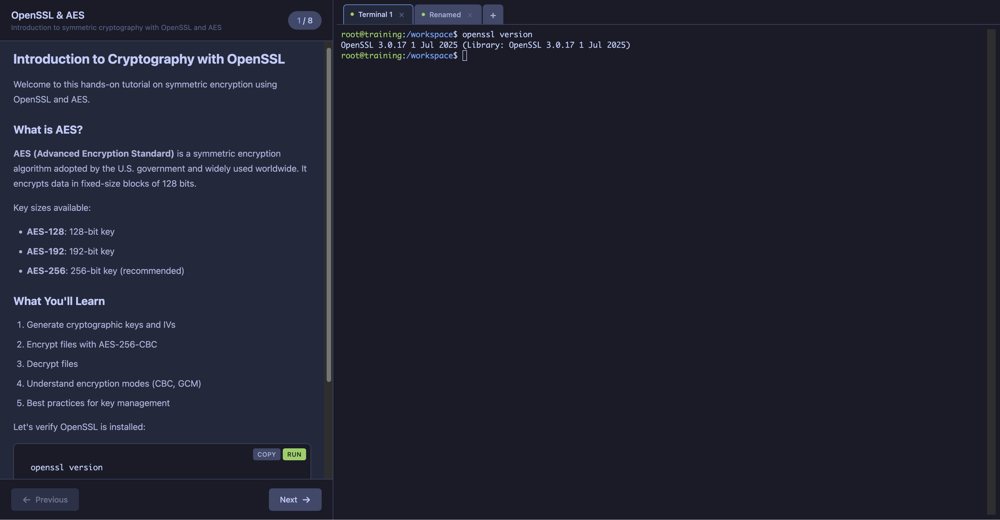

# Training Chart

Interactive training environment with step-by-step instructions and web terminal. A self-hosted alternative to KillerKoda/Katacoda for hands-on tutorials.



## Table of Contents

- [Features](#features)
- [Architecture](#architecture)
- [Quick Start](#quick-start)
- [Creating a Scenario](#creating-a-scenario)
  - [Minimal Example](#minimal-example)
  - [Step Structure](#step-structure)
  - [Writing Check Scripts](#writing-check-scripts)
  - [Markdown Features](#markdown-features)
- [Customizing the Shell Container](#customizing-the-shell-container)
  - [Using a Standard Image](#using-a-standard-image)
  - [Building a Custom Image](#building-a-custom-image)
  - [For Local Development (Kind)](#for-local-development-kind)
  - [Shell Container Examples](#shell-container-examples)
- [Configuration Reference](#configuration-reference)
  - [Scenario Configuration](#scenario-configuration)
  - [Shell Configuration](#shell-configuration)
  - [UI Configuration](#ui-configuration)
  - [Storage Configuration](#storage-configuration)
  - [Ingress Configuration](#ingress-configuration)
  - [Values Injected by Dploy](#values-injected-by-dploy)
- [UI Features](#ui-features)
  - [Multiple Terminal Tabs](#multiple-terminal-tabs)
  - [Code Block Actions](#code-block-actions)
  - [Resizable Panels](#resizable-panels)
- [API Endpoints](#api-endpoints)
- [Example Scenarios](#example-scenarios)
- [Integration with Dploy](#integration-with-dploy)
- [Development](#development)
- [Troubleshooting](#troubleshooting)
- [License](#license)

## Features

- Split-pane interface with markdown instructions and web terminal
- Multiple terminal tabs (same container, independent shells)
- Step-by-step progression with optional validation checks
- Copy/Run buttons on code blocks for quick execution
- Syntax highlighting for code examples
- Resizable panels
- Persistent workspace storage
- Customizable shell container per scenario

## Architecture

```
┌─────────────────────────────────────────────────────────────┐
│                        Ingress                              │
└─────────────────────────────────────────────────────────────┘
                              │
                              ▼
┌─────────────────────────────────────────────────────────────┐
│                      Training UI Pod                        │
│  ┌─────────────────────────────────────────────────────┐   │
│  │  Go Server (embedded web UI)                        │   │
│  │  - Serves HTML/CSS/JS                               │   │
│  │  - API: /api/scenario, /api/steps, /api/steps/check │   │
│  │  - WebSocket: /ws/terminal                          │   │
│  └─────────────────────────────────────────────────────┘   │
└─────────────────────────────────────────────────────────────┘
         │                              │
         │ kubectl exec                 │ Read ConfigMap
         ▼                              ▼
┌──────────────────────┐    ┌──────────────────────────────┐
│    Shell Pod         │    │   Scenario ConfigMap         │
│  (StatefulSet)       │    │  - scenario.yaml             │
│                      │    │  - 01-intro-content.md       │
│  Custom container    │    │  - 01-intro-check.sh         │
│  with tools needed   │    │  - 02-step-content.md        │
│  for the scenario    │    │  - ...                       │
│                      │    │                              │
│  /workspace (PVC)    │    └──────────────────────────────┘
└──────────────────────┘
```

## Quick Start

### 1. Install with Helm

```bash
# Using default Git scenario
helm install my-training ./training

# Using a custom scenario file
helm install openssl-training ./training -f values-openssl-aes.yaml
```

### 2. Access the UI

```bash
# Port-forward if no ingress
kubectl port-forward svc/my-training 8080:8080

# Open http://localhost:8080
```

## Creating a Scenario

A scenario is defined entirely in a `values.yaml` file. Each scenario contains:
- Metadata (name, description, difficulty)
- Steps with markdown content
- Optional validation checks
- Shell container configuration

### Minimal Example

```yaml
# values-my-scenario.yaml

scenario:
  name: "My Tutorial"
  description: "Learn something new"
  difficulty: beginner
  estimatedTime: 15m
  steps:
    - name: "01-intro"
      title: "Introduction"
      content: |
        # Welcome

        This is the first step. Run this command:

        ```bash
        echo "Hello World"
        ```

    - name: "02-task"
      title: "Your Task"
      content: |
        # Do Something

        Create a file:

        ```bash
        echo "content" > myfile.txt
        ```
      check: |
        #!/bin/bash
        if [ -f "/workspace/myfile.txt" ]; then
            echo "File created successfully!"
            exit 0
        else
            echo "Please create myfile.txt"
            exit 1
        fi

# Use default debian container
shell:
  image:
    repository: debian
    tag: bookworm
```

### Step Structure

Each step has:

| Field | Required | Description |
|-------|----------|-------------|
| `name` | Yes | Unique identifier (e.g., `01-introduction`) |
| `title` | Yes | Display title in the UI |
| `content` | Yes | Markdown content with instructions |
| `check` | No | Bash script to validate completion |

### Writing Check Scripts

Check scripts run inside the shell container via `kubectl exec`. They should:
- Exit `0` on success
- Exit `1` on failure
- Print a helpful message explaining the result

```yaml
check: |
  #!/bin/bash
  cd /workspace/my-project 2>/dev/null || {
      echo "Directory not found. Run: mkdir /workspace/my-project"
      exit 1
  }

  if [ -f "config.json" ]; then
      echo "Configuration file found!"
      exit 0
  else
      echo "Missing config.json - create it with the editor"
      exit 1
  fi
```

### Markdown Features

The content field supports GitHub-flavored markdown:

```yaml
content: |
  # Heading 1
  ## Heading 2

  Regular paragraph with **bold** and *italic*.

  - Bullet list
  - Another item

  1. Numbered list
  2. Second item

  > Blockquote for tips or warnings

  Inline `code` or code blocks:

  ```bash
  kubectl get pods
  ```

  ```python
  print("Hello")
  ```
```

Code blocks with language hints get syntax highlighting. Bash blocks show Copy and Run buttons on hover.

## Customizing the Shell Container

The shell container is where users execute commands. Customize it based on your scenario's needs.

### Using a Standard Image

```yaml
shell:
  image:
    repository: debian
    tag: bookworm
    pullPolicy: IfNotPresent

  command: ["sleep"]
  args: ["infinity"]
```

### Building a Custom Image

Create a `Containerfile` with the tools your scenario needs:

```dockerfile
# Containerfile.my-scenario
FROM debian:bookworm

# Install required tools
RUN apt-get update && apt-get install -y --no-install-recommends \
    curl \
    vim \
    git \
    jq \
    # Add your tools here
    python3 \
    python3-pip \
    && rm -rf /var/lib/apt/lists/*

# Install Python packages if needed
RUN pip3 install requests pyyaml

# Create workspace
RUN mkdir -p /workspace && chmod 777 /workspace
WORKDIR /workspace

# Custom prompt
RUN echo 'export PS1="\[\e[32m\]\u@training\[\e[0m\]:\[\e[34m\]\w\[\e[0m\]\$ "' >> /etc/bash.bashrc

CMD ["sleep", "infinity"]
```

Build and use it:

```bash
# Build
docker build -f Containerfile.my-scenario -t myregistry/my-training-shell:v1 .

# Push to registry
docker push myregistry/my-training-shell:v1
```

```yaml
# values-my-scenario.yaml
shell:
  image:
    repository: myregistry/my-training-shell
    tag: v1
    pullPolicy: IfNotPresent
```

### For Local Development (Kind)

```bash
# Build locally
docker build -f Containerfile.my-scenario -t my-training-shell:latest .

# Load into Kind cluster
kind load docker-image my-training-shell:latest --name my-cluster
```

```yaml
shell:
  image:
    repository: my-training-shell
    tag: latest
    pullPolicy: IfNotPresent  # Important for local images
```

### Shell Container Examples

**Kubernetes Training:**
```dockerfile
FROM debian:bookworm
RUN apt-get update && apt-get install -y curl ca-certificates && \
    curl -LO "https://dl.k8s.io/release/$(curl -L -s https://dl.k8s.io/release/stable.txt)/bin/linux/amd64/kubectl" && \
    chmod +x kubectl && mv kubectl /usr/local/bin/
```

**Python Development:**
```dockerfile
FROM python:3.11-slim
RUN pip install flask pytest requests
```

**Network Tools:**
```dockerfile
FROM debian:bookworm
RUN apt-get update && apt-get install -y \
    net-tools iputils-ping dnsutils tcpdump nmap netcat-openbsd
```

**Cryptography (OpenSSL):**
```dockerfile
FROM debian:bookworm
RUN apt-get update && apt-get install -y openssl xxd
```

## Configuration Reference

### Scenario Configuration

```yaml
scenario:
  name: "Tutorial Name"           # Required: Display name
  description: "Description"      # Required: Short description
  difficulty: beginner            # Optional: beginner/intermediate/advanced
  estimatedTime: 30m              # Optional: Estimated completion time
  steps: []                       # Required: List of steps
```

### Shell Configuration

```yaml
shell:
  image:
    repository: debian            # Container image
    tag: bookworm                 # Image tag
    pullPolicy: IfNotPresent      # Always/IfNotPresent/Never

  command: ["sleep"]              # Override entrypoint
  args: ["infinity"]              # Command arguments

  resources:
    requests:
      memory: "256Mi"
      cpu: "100m"
    limits:
      memory: "512Mi"
      cpu: "500m"

  securityContext:
    capabilities:
      drop: ["ALL"]
      add: ["SETGID", "SETUID"]   # Add capabilities if needed
    allowPrivilegeEscalation: false
```

### UI Configuration

```yaml
ui:
  image:
    repository: aydev/training-ui
    tag: latest
    pullPolicy: IfNotPresent

  resources:
    requests:
      memory: "64Mi"
      cpu: "50m"
    limits:
      memory: "128Mi"
      cpu: "200m"
```

### Storage Configuration

```yaml
persistence:
  enabled: true                   # Enable persistent workspace
  storageClass: ""                # Use default storage class
  accessModes:
    - ReadWriteOnce
  size: "1Gi"                     # Workspace size
  mountPath: "/workspace"         # Mount path in container
```

### Ingress Configuration

```yaml
ingress:
  enabled: true
  className: "nginx"              # Ingress class
  annotations:
    cert-manager.io/cluster-issuer: letsencrypt
  tls:
    - secretName: training-tls
      hosts:
        - training.example.com
```

### Values Injected by Dploy

When deployed via dploy API, these values are automatically injected:

```yaml
username: "john-doe"              # User's username
uuid: "a1b2c3d4"                  # Unique environment ID
ingressHost: "john-doe-a1b2c3d4.env.dploy.dev"
```

## UI Features

### Multiple Terminal Tabs

- Click `+` to open a new terminal tab
- `Ctrl+Shift+T`: New tab
- `Ctrl+Shift+W`: Close current tab
- `Ctrl+Tab`: Next tab
- Double-click tab to rename

### Code Block Actions

Hover over code blocks to see:
- **Copy**: Copy code to clipboard
- **Run**: Execute directly in the active terminal

### Resizable Panels

Drag the divider between instructions and terminal to resize.

## API Endpoints

| Endpoint | Method | Description |
|----------|--------|-------------|
| `/api/scenario` | GET | Get scenario metadata |
| `/api/steps` | GET | List all steps |
| `/api/steps/:n` | GET | Get step content |
| `/api/steps/:n/check` | POST | Run verification |
| `/api/health` | GET | Health check |
| `/ws/terminal` | WebSocket | Terminal connection |

## Example Scenarios

### Git Basics (default)

```bash
helm install git-training ./training
```

### OpenSSL & AES Cryptography

```bash
helm install openssl-training ./training -f values-openssl-aes.yaml
```

## Integration with Dploy

Add to your `environments.yaml`:

```yaml
- name: git-training
  description: "Learn Git basics"
  oci: "oci://ghcr.io/myorg/charts/training"
  version: "1.0.0"
  enabled: true
  icon: "graduation-cap"
  ttlHours: 2
  maxPerUser: 1
```

## Development

### Building Images

```bash
# Build UI image
docker build -f Containerfile.ui -t aydev/training-ui:latest .

# Build scenario shell image
docker build -f Containerfile.scenario -t aydev/training-shell:latest .
```

### Local Testing with Kind

```bash
# Load images
kind load docker-image aydev/training-ui:latest --name my-cluster
kind load docker-image aydev/training-shell:latest --name my-cluster

# Install chart
helm install test ./training -f values-openssl-aes.yaml

# Port-forward
kubectl port-forward svc/test-training 8080:8080
```

## Troubleshooting

### Terminal not connecting

Check that the shell pod is running:
```bash
kubectl get pods -l app.kubernetes.io/component=shell
```

### Check script not working

Ensure the script is executable and uses proper shebang:
```yaml
check: |
  #!/bin/bash
  # Your script here
```

### Images not pulling (ImagePullBackOff)

For local images in Kind:
```yaml
shell:
  image:
    pullPolicy: IfNotPresent  # Not "Always"
```

## License

MIT
